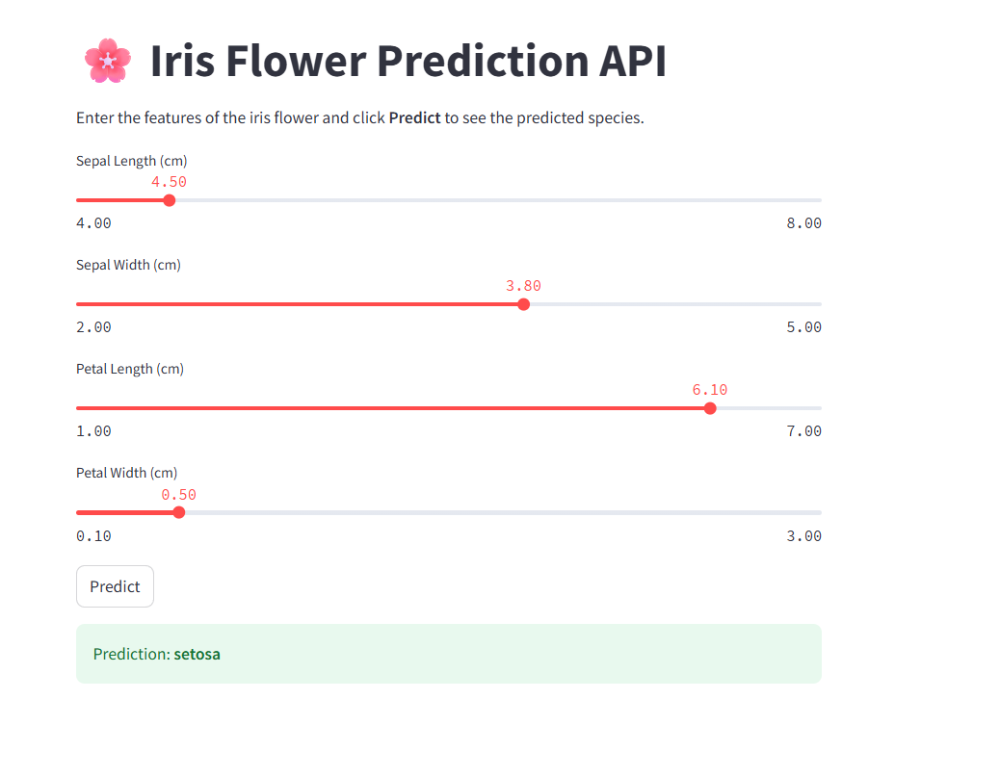

# 🌸 Project 2 – Iris Classification API Deployment

This project demonstrates how to **deploy a Machine Learning model as a REST API** using FastAPI.  
It is a continuation of Project 1 (Iris classification with RandomForest), now packaged as a service ready for testing and deployment.

---

## 🎯 Project Objective

- load the trained model using `joblib`.  
- Build a FastAPI application to expose the model as a REST API (`/predict`).  
- Allow external users or applications to send feature values and receive predictions.

---

## 🛠️ Technologies Used

- Python 3
- scikit-learn
- joblib
- FastAPI
- Uvicorn
- pandas (optional for data manipulation)
- matplotlib / seaborn (optional for visualizations)

---

## 📂 Project Structure


## 📝 Input Format for Prediction

The RandomForest model expects the following **features in this exact order**:

| Feature Name   | Type   | Description                     |
|----------------|--------|---------------------------------|
| sepal_length   | float  | Length of the sepal in cm       |
| sepal_width    | float  | Width of the sepal in cm        |
| petal_length   | float  | Length of the petal in cm       |
| petal_width    | float  | Width of the petal in cm        |

### Example JSON request

```json
{
  "sepal_length": 5.1,
  "sepal_width": 3.5,
  "petal_length": 1.4,
  "petal_width": 0.2
}

## Front-end de l'application
Voici une capture d'écran de l'interface utilisateur de l'application Iris Predictor :

